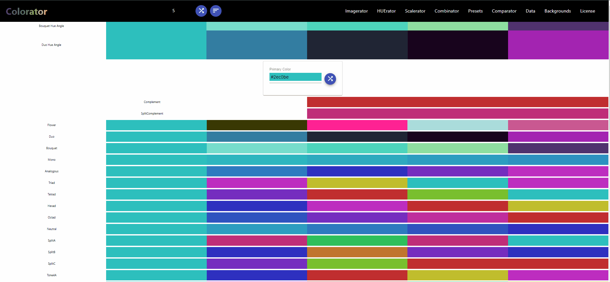
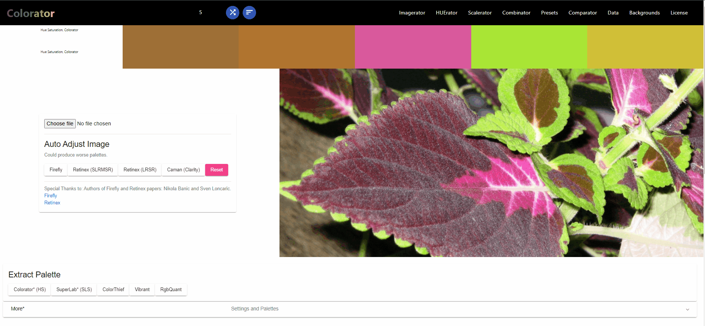

# Colorator - Advanced Color Palette Generator

**Colorator** is an Angular application for extracting and organizing colors from images in unique and customizable ways. This tool enables users to create color palettes by analyzing images using a variety of algorithms, including custom methods that prioritize hues and saturation levels to pick diverse and aesthetically pleasing colors. Colorator is ideal for designers, developers, and artists looking to create or explore color palettes for logos, websites, or art projects.

---

## Key Features

- **Advanced Color Extraction**: Use various techniques to extract colors, including a custom algorithm that sorts colors by hue and saturation, creating palettes with balanced and unique shades.
- **Multiple Color Processing Options**: Choose from algorithms based on hue, saturation, lightness, and advanced color models like CIELAB for perceptually uniform palettes.
- **Background Generation**: Generate backgrounds with your extracted colors, suitable for use in design and UI/UX projects.
- **Color Correction**: Apply image color correction using algorithms inspired by academic research on white balance (Firefly and Retinex) to ensure accurate color representation.
- **Flexible Palette Size**: Choose the number of colors for your palette, from 5 to 1000 colors.
- **Angular and TypeScript Adaptation**: Some algorithms were rewritten from JavaScript to TypeScript for seamless Angular integration.

---

## How Colorator Works

Colorator includes several methods for generating color palettes from images. Here’s an overview of the custom and library-based algorithms used:

1. **Custom Hue-Saturation Sorting Algorithm**:

   - Extracts colors from the image, sampling every 10 pixels.
   - Sorts colors by **Hue** and discretizes by color count, followed by **Saturation** sorting.
   - Colors are further discretized by saturation level, picking representative shades that aren’t too bright or dark, achieving a visually balanced palette.
   - This method, developed independently, is designed to highlight colors that are distinct yet harmonious.

2. **White Balance and Color Correction**:

   - Integrates techniques from **Firefly** and **Retinex** papers for local brightness adjustment and color constancy.
   - These algorithms adjust the image’s color to remove tints and improve color accuracy.

3. **Multiple Pre-Existing Algorithms**:
   - Color extraction algorithms like **ColorThief** and **node-vibrant** were adapted for Angular and TypeScript.
   - Libraries such as **Chroma.js** and **TinyColor** provided additional methods for hue calculations and color manipulation.

---

## Usage Examples

### Creating a Custom Palette

1. **Upload an Image**: Select an image from which you want to extract colors.
2. **Choose Extraction Method**: Choose from various algorithms, including custom hue-saturation, perceptual lightness, or library-based methods.
3. **Select Palette Size**: Specify the number of colors you want in the palette.
4. **Generate Background** _(Optional)_: Use the extracted colors to create visually appealing backgrounds.

### Application in Design

- **Logo Design**: Extract a set of cohesive colors from an inspiration image to inform logo colors.
- **Web Design**: Generate color schemes for backgrounds, buttons, and icons that resonate with the chosen image’s aesthetic.
- **Art Projects**: Pick colors that are meaningful or invoke specific moods based on the source image.

---

## Licensing and Acknowledgments

Colorator is a combination of original code and contributions from various open-source projects. The following libraries and algorithms have been integrated, adapted, or inspired Colorator’s color extraction methods.

### License Summary

- **Apache 2.0**: For code modified and combined with other Apache 2 licensed libraries.
- **MIT License**: For parts of the code that exclusively use MIT-licensed libraries or are original code.
- **BSD 2 & BSD 3**: For libraries that require specific attributions.

### Special Thanks

**Colorator** utilizes and acknowledges contributions from the authors of **Firefly** and **Retinex** papers:

- **Firefly** - "A Hardware-friendly Real-Time Local Brightness Adjustment"
- **Retinex** - "Smart Light Random Memory Sprays Retinex"
- Special thanks to Nikola Banic and Sven Loncaric for permission to use these techniques.

### Full License Details

- **Chroma.js** (Apache 2): [License Link](https://github.com/gka/chroma.js/blob/master/LICENSE)
- **ColorThief** (MIT): [License Link](https://github.com/lokesh/color-thief/blob/master/LICENSE)
- **TinyColor** (MIT): [License Link](https://github.com/bgrins/TinyColor/blob/master/LICENSE)
- **d3** (BSD 3): [License Link](https://github.com/d3/d3/blob/master/LICENSE)
- **CamanJS** (BSD 3): Parts were modified to function with Angular and Node.js setups.

Please refer to the `LICENSE` files of each respective library for further details on usage permissions and restrictions.

---

## Contributing

Colorator is open for contributions! If you have ideas for new color extraction techniques or improvements to existing algorithms, feel free to fork the repository, make changes, and submit a pull request.

---

## Screenshots and Demos

Explore Colorator’s capabilities through these demos:

- **Image to Palette**  
  

- **Generate Background**  
  

---

## Contact

For questions, suggestions, or feedback, feel free to reach out on [GitHub](https://github.com/k-gintaras) or connect with me on [LinkedIn](#).

---

Thank you for checking out **Colorator**! Happy palette crafting!
